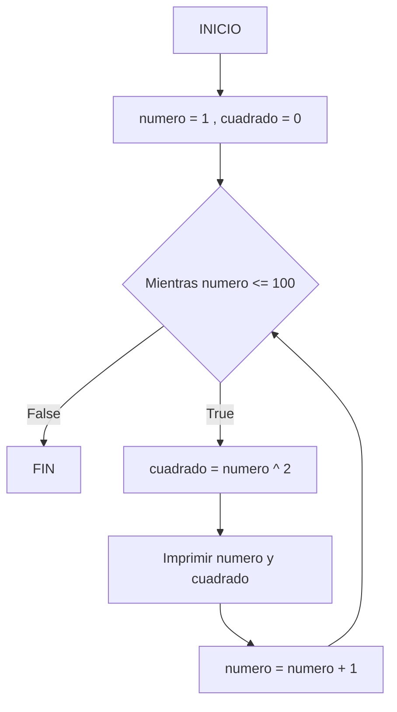
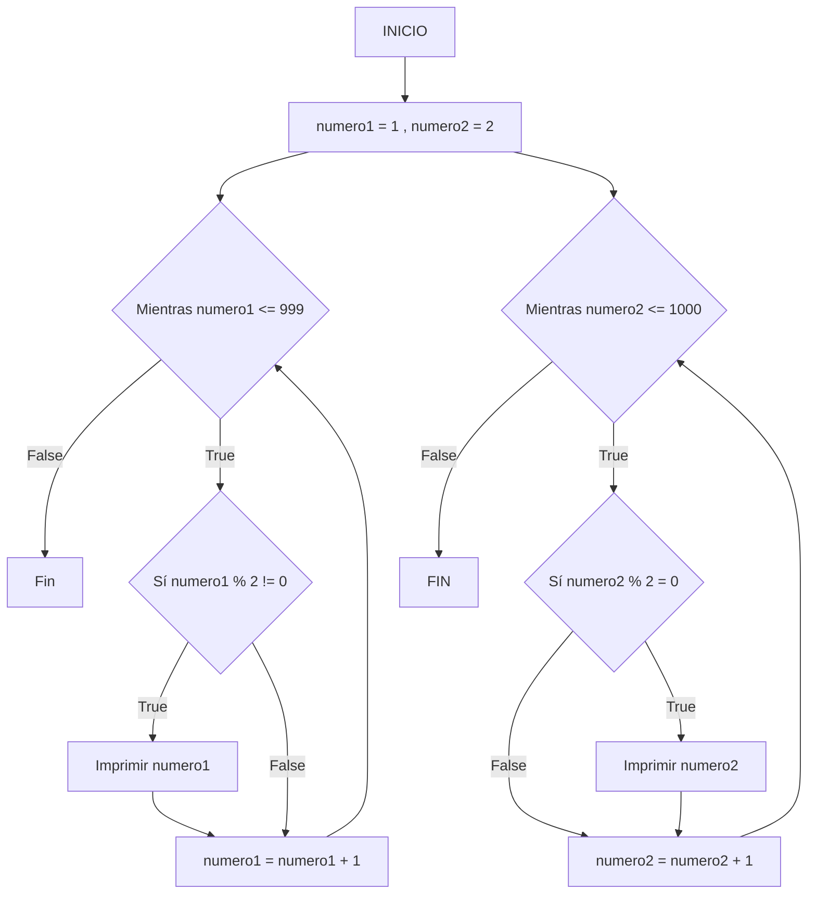
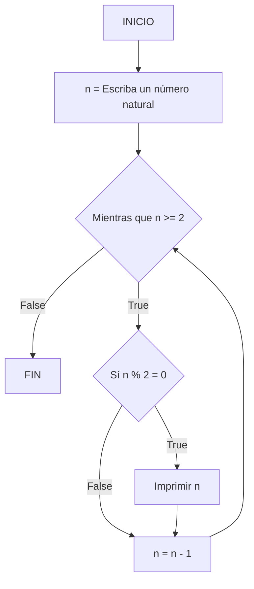

# RETO 7 👽
## BUCLES WHILE

#### En el repositorio se encuentra documentado los ejercicios de el Reto 7.

1. Imprimir un listado con los números del 1 al 100 cada uno con su respectivo cuadrado.

2. Imprimir un listado con los números impares desde 1 hasta 999 y seguidamente otro listado con los números pares desde 2 hasta 1000.

3. Imprimir los números pares en forma descendente hasta 2 que son menores o iguales a un número natural n ≥ 2 dado

