# RETO 7 👽
## BUCLES WHILE

#### En el repositorio se encuentra documentado los ejercicios de el Reto 7.

1. Imprimir un listado con los números del 1 al 100 cada uno con su respectivo cuadrado.

2. Imprimir un listado con los números impares desde 1 hasta 999 y seguidamente otro listado con los números pares desde 2 hasta 1000.

```mermaid
graph TD
    A[INICIO] --> B[numero1 = 1 , numero2 = 2]
    B --> C{Mientras numero1 <= 999}
    B --> D{Mientras numero2 <= 1000}
    C --> |False|Z[Fin]
    C --> |True|E{Sí numero1 % 2 != 0}
    E --> |True|F[Imprimir numero1]
    F --> G[numero1 = numero1 + 1]
    E --> |False|G
    G --> C 
    D --> |True|d{Sí numero2 % 2 = 0}
    d --> |False|a
    d --> |True|e[Imprimir numero2]
    e --> a[numero2 = numero2 + 1]
    a --> D
    D --> |False|z[FIN]
```

3. Imprimir los números pares en forma descendente hasta 2 que son menores o iguales a un número natural n ≥ 2 dado

